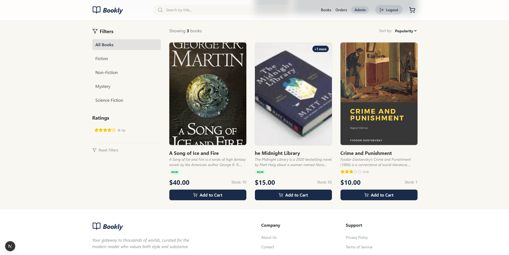
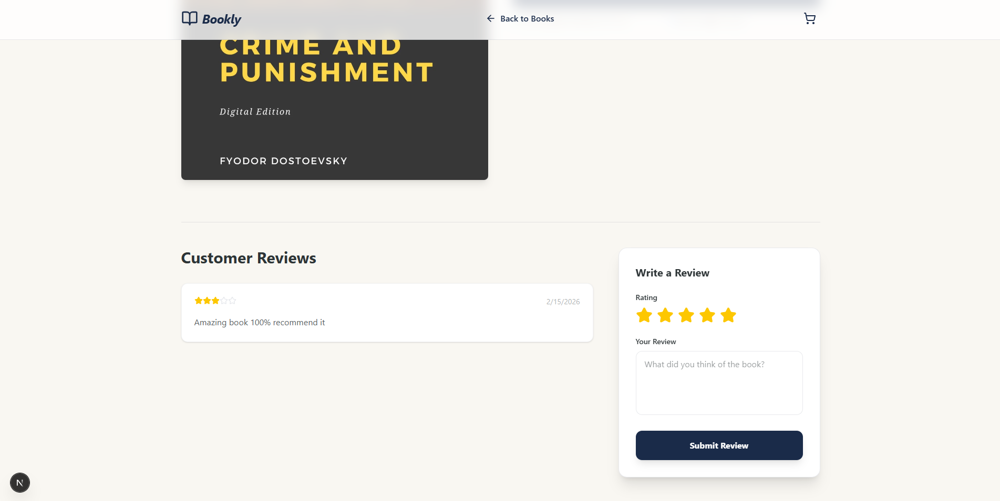
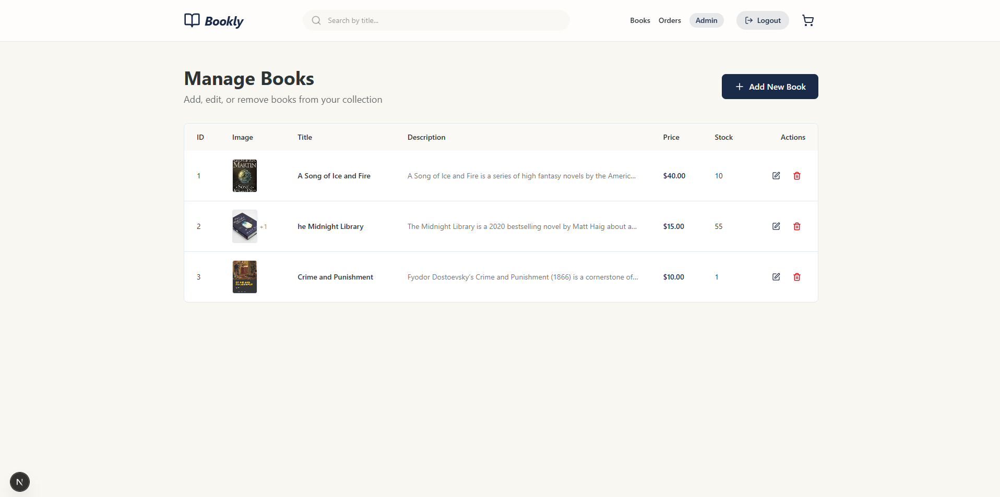

# Bookly

**Bookly** in a premium, full-stack e-commerce application for book enthusiasts. Built with a modern tech stack, it offers a seamless shopping experience from browsing beautifully curated collections to secure checkout and real-time community engagement.

## Visual Tour


*The elegant storefront featuring curated collections and real-time search.*


*Detailed book pages with dynamic inventory tracking and community reviews.*


*A powerful admin panel for managing inventory, orders, and library content.*

## Key Features

- **Modern Shopping Experience**: Fast, responsive, and visually stunning UI built with Next.js and Tailwind CSS.
- **Book Review System**: Real-time star ratings and community comments for every book in the library.
- **Dynamic Inventory**: Automatic stock management that updates in real-time after every successful purchase.
- **Secure Payments**: Fully integrated Stripe checkout with webhook support for reliable order processing.
- **Advanced Filtering**: Smart filtering by price, genre, and search queries to help users find their next read.
- **Robust Admin Panel**: Complete control over book listings, image uploads, and order management.
- **Secure Authentication**: Choice between secure email/password or seamless Google OAuth login.

## Default Admin Credentials

When you first start the application, a default admin account is automatically created:

- **Email:** `admin@bookly.com`
- **Password:** `password123`
- **Role:** `admin`

## Quick Start

### Backend Setup

```bash
cd backend
pip install -r requirements.txt
# or using uv
uv sync

# Create .env file with your configuration
cp .env.example .env
# Edit .env and add your Stripe keys

# Run migrations if needed
python -m alembic upgrade head

# Start the server
python -m uvicorn app.main:app --reload
```

Backend runs on: `http://localhost:8000`

### Frontend Setup

```bash
cd frontend
npm install

# Create .env.local file
cp .env.example .env.local
# Edit .env.local and add your Stripe publishable key

# Start development server
npm run dev
```

Frontend runs on: `http://localhost:3000`

## Payment Integration

Bookly uses **Stripe** for secure payment processing.

### Setup Stripe

1. Create a [Stripe account](https://stripe.com)
2. Get your API keys from the Stripe Dashboard
3. Add keys to backend `.env`:
   ```
   STRIPE_SECRET_KEY=sk_test_...
   STRIPE_PUBLISHABLE_KEY=pk_test_...
   ```
4. Add key to frontend `.env.local`:
   ```
   NEXT_PUBLIC_STRIPE_PUBLISHABLE_KEY=pk_test_...
   ```

### Payment Flow

1. Add books to cart
2. Click "Proceed to Checkout"
3. Complete payment on Stripe Checkout
4. View orders in dashboard

**For detailed setup instructions, see [PAYMENT_SETUP_GUIDE.md](./PAYMENT_SETUP_GUIDE.md)**

For Stripe integration documentation, see [STRIPE_INTEGRATION.md](./STRIPE_INTEGRATION.md)

## Technology Stack

### Backend

- **Framework**: FastAPI
- **Database**: SQLite (AsyncIO)
- **Auth**: FastAPI-Users with JWT
- **Payment**: Stripe
- **ORM**: SQLAlchemy

### Frontend

- **Framework**: Next.js 16
- **Language**: TypeScript
- **Styling**: Tailwind CSS
- **Payment UI**: Stripe.js

## Project Structure

```
Bookly/
├── backend/                    # FastAPI backend
│   ├── app/
│   │   ├── api/               # API routes
│   │   ├── models/            # Database models
│   │   ├── schemas/           # Pydantic schemas
│   │   ├── core/              # Config, security, Stripe
│   │   └── db/                # Database session
│   ├── .env.example           # Environment template
│   └── pyproject.toml         # Python dependencies
│
├── frontend/                   # Next.js frontend
│   ├── app/                   # Page routes
│   ├── components/            # React components
│   ├── lib/                   # Utilities and API clients
│   ├── .env.example           # Environment template
│   └── package.json           # Node dependencies
│
├── PAYMENT_SETUP_GUIDE.md     # Payment setup instructions
├── STRIPE_INTEGRATION.md      # Stripe API documentation
└── README.md                  # This file
```

## API Endpoints

### Authentication

- `POST /api/auth/register` - Register new user
- `POST /api/auth/jwt/login` - Login with email
- `POST /api/auth/google/callback` - Google OAuth callback
- `POST /api/auth/logout` - Logout

### Books

- `GET /api/books` - List all books
- `GET /api/books/{id}` - Get book details
- `POST /api/books` - Create book (admin)
- `PUT /api/books/{id}` - Update book (admin)
- `DELETE /api/books/{id}` - Delete book (admin)

### Cart

- `GET /api/cart` - Get user's cart
- `POST /api/cart/items` - Add item to cart
- `PUT /api/cart/items/{id}` - Update item quantity
- `DELETE /api/cart/items/{id}` - Remove item from cart

### Payments

- `POST /api/payments/checkout/session` - Create Stripe checkout session
- `POST /api/payments/payment-intent` - Create payment intent
- `GET /api/payments/orders` - Get user's orders
- `GET /api/payments/orders/{id}` - Get order details
- `POST /api/payments/webhook` - Stripe webhook


## License

This project is for educational purposes only. 